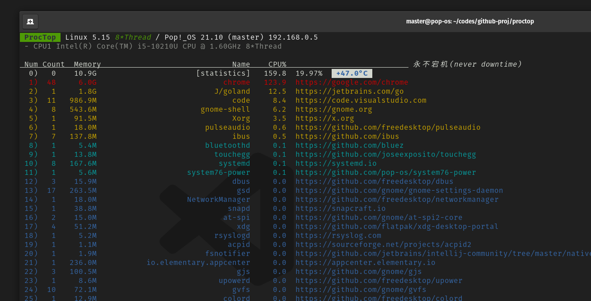

# proctop

适用于 Linux 的性能分析工具，实时显示进程的资源占用状态，类似于 TOP。具备 Java 增强功能。

<br>



<br>

## Install script

```sh
pkg='elf.x64-proctop.tar.gz'; \
wget https://github.com/matsuwin/proctop/releases/download/v0.1.6/$pkg; \
sudo tar -C /bin -xf $pkg; \
rm -f $pkg
```

<br>

## Quick Start

```sh
$ proctop --help
Usage of proctop:
  -java
    	Java process list
  -l int
    	limit (default 10)
  -version
    	show version information
```

```sh
proctop -l 55
```
