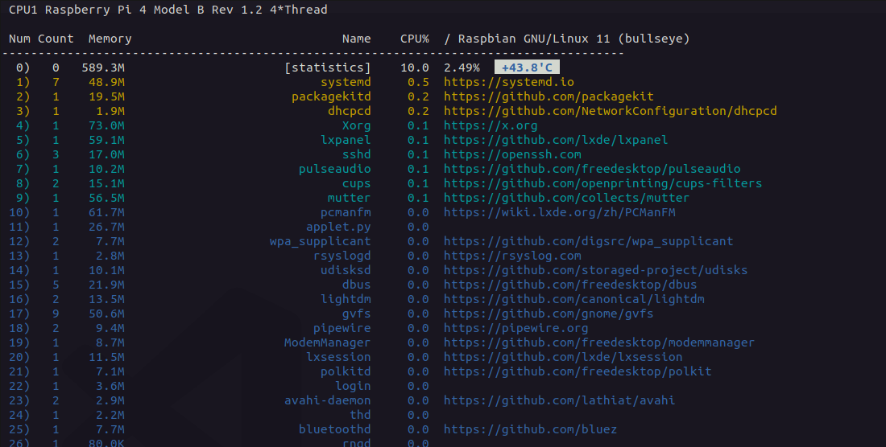

# proctop

适用于 Linux 的性能分析工具，实时显示进程的资源占用状态，类似于 TOP。具备 Java 增强功能。

**同样适用于 Raspberry Pi (树莓派)。*

<br>



<br>

## Installing

*Linux/amd64*

```sh
sudo curl https://raw.githubusercontent.com/matsuwin/proctop/main/setup.sh | sh
```

*Raspberry Pi*

```sh
sudo curl https://raw.githubusercontent.com/matsuwin/proctop/main/setup-rasp.sh | sh
```

<br>

## Quick Start

```sh
$ proctop --help
Usage of proctop:
  -java
    	Java process list
  -l int
    	limit (default 10)
  -version
    	show version information
```

```sh
proctop -l 55
```
